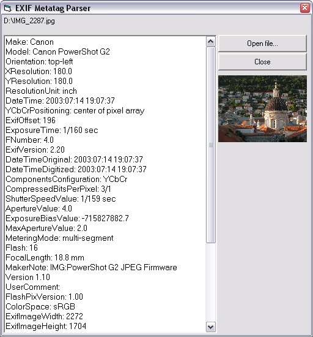



## Digital Camera JPEG MetaInfo Reader

### Description

A small class to retrieve most of the information contained in the EXIF header of a digital camera JPEG file - such as Date/Time, Shutter Speed, Focusing Distance, Aperture Value and many others.
 
### More Info
 

             |
---                |---
**Submitted On**   |2003-09-03 04:07:02
**By**             |[Jordy](https://github.com/Planet-Source-Code/PSCIndex/blob/master/ByAuthor/jordy.md)
**Level**          |Intermediate
**User Rating**    |4.5 (45 globes from 10 users)
**Compatibility**  |VB 5\.0, VB 6\.0
**Category**       |[Graphics](https://github.com/Planet-Source-Code/PSCIndex/blob/master/ByCategory/graphics__1-46.md)
**World**          |[Visual Basic](https://github.com/Planet-Source-Code/PSCIndex/blob/master/ByWorld/visual-basic.md)
**Archive File**   |[Digital\_Ca164021932003\.zip](https://github.com/Planet-Source-Code/jordy-digital-camera-jpeg-metainfo-reader__1-48209/archive/master.zip)

